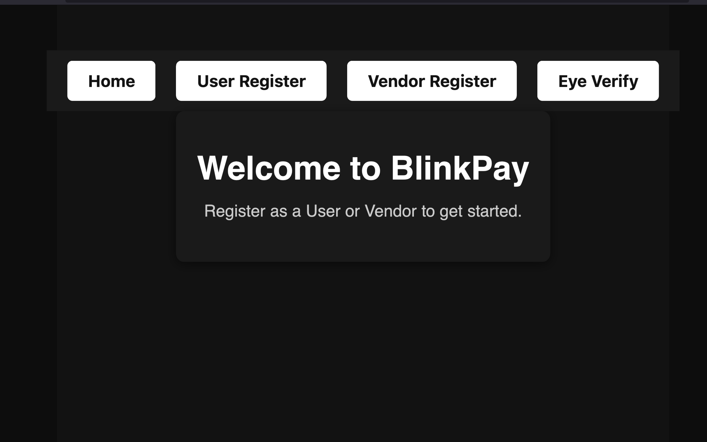
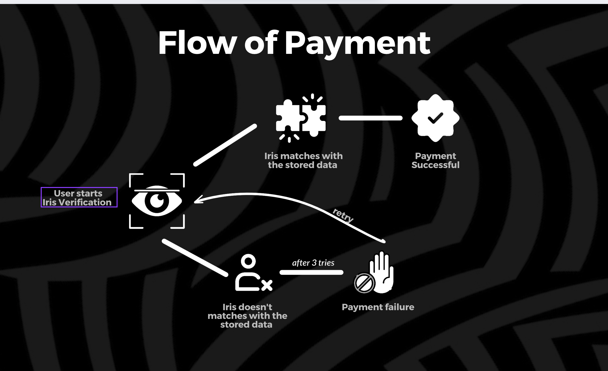
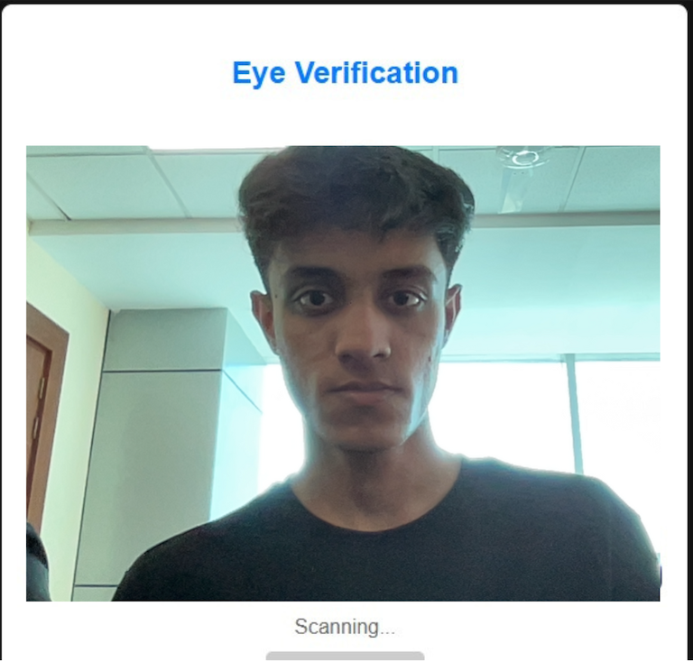

# BlinkPay
BLINKPAY - THINK, BLINK, PAY
BlinkPay is an Ai-powered biometric payment system that lets
users pay using eye scanning + predefined eye movement patterns.


## Table of Contents
- [Features](#features)
- [Tech Stack](#tech-stack)
- [Setup Instructions](#setup-instructions)
- [Usage](#usage)
- [API Endpoints](#api-endpoints)
- [Contributors](#contributors)

## Features
- User and Vendor Registration with Eye Scan
- Eye Scan Authentication
- Payment Processing
- Vendor Dashboard to Track Payments
- User Dashboard to View Transactions

## How OpenCv is being used ?
Eye Authentication System
This project implements an eye authentication system using FastAPI and face_recognition. It allows users to register their faces and verify their identity by comparing captured images with stored ones.

Features
User and Vendor Registration: Register users and vendors with face scans.
Eye Verification: Authenticate users and vendors by comparing captured images with stored ones.
Strict Similarity Threshold: Ensure accurate matches with a strict similarity threshold.
Image Storage: Store images in designated directories.

## Project Screenshots

### Home Page


### Payment flow


### User Registration


### Eye Verification


## Tech Stack
### Frontend
- React
- Vite
- React Router
- React Webcam


### Backend
- Node.js
- Express
- MongoDB
- Mongoose

### Python
-OpenCV
## Setup Instructions

### Prerequisites
- Node.js
- MongoDB

### Frontend
1. Navigate to the frontend directory:
    ```sh
    cd /Users/harshsharma/Desktop/Desktop/programming/Hackathon/frontend
    ```
2. Install dependencies:
    ```sh
    npm install
    ```
3. Start the development server:
    ```sh
    npm run dev
    ```

### Backend
1. Navigate to the backend directory:
    ```sh
    cd /Users/harshsharma/Desktop/Desktop/programming/Hackathon/backend
    ```
2. Install dependencies:
    ```sh
    npm install
    pip install fastapi uvicorn face_recognition pymongo numpy opencv-python scipy
    uvicorn main:app --reload
    ```
3. Create a `.env` file in the backend directory and add the following:
    ```properties
    PORT=5000
    MONGO_URI=mongodb://localhost:27017/
    ```
4. Start the backend server:
    ```sh
    npm run dev
    ```

## Usage
1. Open the frontend application in your browser (usually at `http://localhost:3000`).
2. Register as a User or Vendor.
3. Use the Eye Scan Authentication to log in.
4. Proceed to make payments or view the dashboard.

## API Endpoints
### User Registration
- **URL:** `/register_user/`
- **Method:** `POST`
- **Body:**
    ```json
    {
        "name": "string",
        "upi_id": "string",
        "image": "file"
    }
    ```

### Vendor Registration
- **URL:** `/register_vendor/`
- **Method:** `POST`
- **Body:**
    ```json
    {
        "name": "string",
        "upi_id": "string",
        "image": "file"
    }
    ```

### Eye Verification
- **URL:** `/verify_eye/`
- **Method:** `POST`
- **Body:**
    ```json
    {
        "image": "file"
    }
    ```

## Folder Structure

```
/Users/harshsharma/Desktop/Desktop/programming/Hackathon
├── backend
│   ├── .env
│   ├── package.json
│   ├── server.js
│   └── // ...other backend files...
├── frontend
│   ├── src
│   │   ├── assets
│   │   │   ├── home.png
│   │   │   ├── userReg.png
│   │   │   └── eyeVer.png
│   │   ├── pages
│   │   │   ├── Register.jsx
│   │   │   └── Register.css
│   │   └── // ...other frontend files...
│   ├── package.json
│   └── vite.config.js
├── README.md
└── // ...other project files...
```

## Contributors
- Harsh Sharma
- Abhay
- Awanish Kumar
